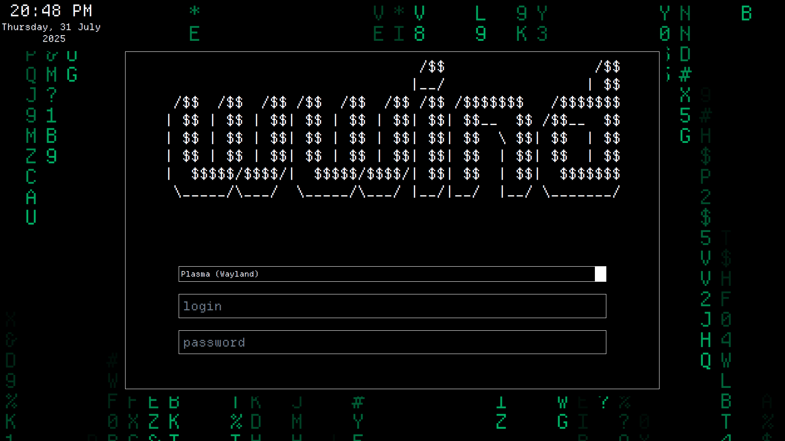

# Matrix SDDM

## Install

- Move the contents of this repository to `/usr/share/sddm/themes/matrix`
- Select this theme from your System Settings > SDDM Theme.
- Enjoy!

## Customizing

A lot of variables have been placed in the root element of `Main.qml`. You can customize these to your heart's content.

## Contact

Contact me at https://winnerwind.in in case you want to comment on something.
